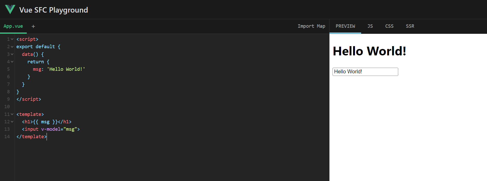

# 如何使用 vue 文件

## 简介
在初学 Vue 时可能需要预览 Vue 单文件组件（Single-File Component，缩写为 SFC）。它是一种可复用的代码组织形式，将从属于同一个组件的 HTML、CSS 和 JavaScript 封装在使用`.vue`后缀的文件中。

## 预览方式一

直接使用 Vue 官网的  [Playground](https://sfc.vuejs.org/#eNo9j01qAzEMha+iapMWOjbdDm6gu96gG2/cjJJM8B+2nBaGuXvlpBMwtj4/JL234EfO6toIRzT1UObMexvpN6fCMNHRNc+w2AgwOXbPL/caoBC3EjcCCPU0wu6TvE/wlYqfnnZ3ae2PXHKMfiwQYArZOyYhAHN+2y9LnwLrarTQ7XeOuTFch5Am8u8WRbcoktGPbnzFOXS3Q3BZXWqKkuRmy/4L1eK4GbUoUTtbPDPnOmpdj4ee/1JVKictlSot8hxIUQ3Dd0k/lYoMtrglwfUPkXdoJg==) 。



## 预览方式二

本地创建一个 Vue 应用。

首先需要安装最新的 Node.js，然后再命令行运行如下命令：
```bash
$npm init vue@latest
```

这一指令会安装并执行 create-vue，它是 Vue 官方的脚手架工具。你将会看到一些诸如 TypeScript 和测试支持之类的可选功能提示：
```bash
✔ Project name: … <your-project-name>
✔ Add TypeScript? … No / Yes
✔ Add JSX Support? … No / Yes
✔ Add Vue Router for Single Page Application development? … No / Yes
✔ Add Pinia for state management? … No / Yes
✔ Add Vitest for Unit testing? … No / Yes
✔ Add Cypress for both Unit and End-to-End testing? … No / Yes
✔ Add ESLint for code quality? … No / Yes
✔ Add Prettier for code formatting? … No / Yes

Scaffolding project in ./<your-project-name>...
Done.
```

如果不确定是否要开启某个功能，你可以直接按下回车键选择 No。在项目被创建后，通过以下步骤安装依赖并启动开发服务器：
```bash
$cd <your-project-name>
$npm install
$npm run dev
```
此时你就已经运行了该 Vue 项目。

## Reference

[1] https://zhuanlan.zhihu.com/p/535102297

[2] https://cn.vuejs.org/guide/quick-start.html#try-vue-online